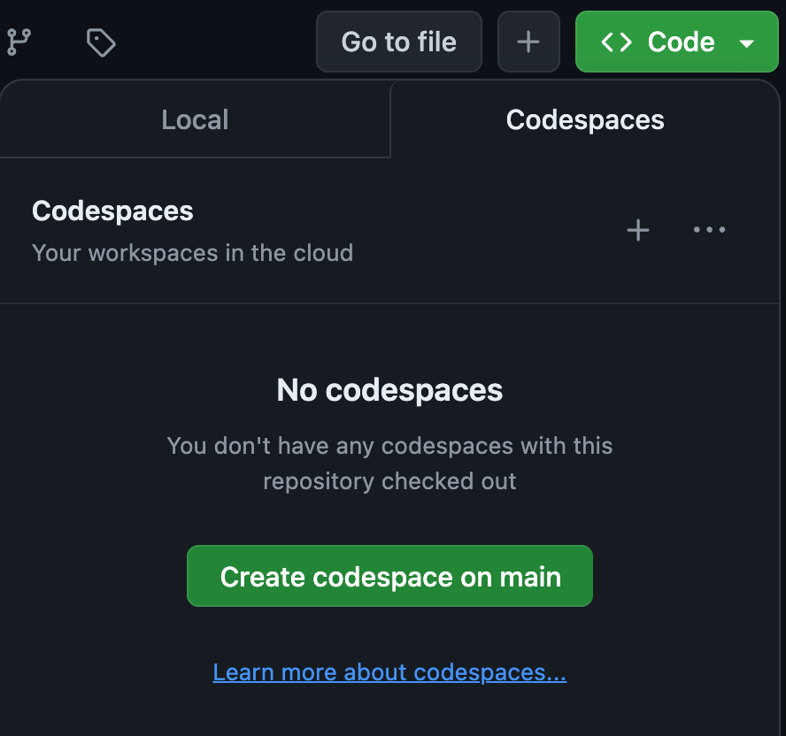

# LLM_zoomcamp
This is a Zoomcamp that will teach dealing with LLMS from an operation level.

<<<<<<< HEAD
# Module 1: Chat with Your Own Data : Introduction to the LLM Zoomcamp.

## Steps to set this up with Code Spaces.
**Step1:** - Click on the main repo of the course : [Introduction to the LLM Zoomcamp](https://github.com/alexeygrigorev/llm-rag-workshop). You will see all content of the first Module. 

**Step2:** - At this point I am assuming that you have already created your repository.If you dont know how to do that, you can check out ["How to create a Github repository"](https://docs.github.com/en/repositories/creating-and-managing-repositories/creating-a-new-repository).In your github repository, click on code spaces in the top right space named **code <>**. See the following . 

You will see a new online visual studio platform pop up and you can work on that. 

 **_NOTE:_** : You have to restart the run every time you want to work in code spaces. 

Alternatively you can click on the options on the top right menu of your code spaces and work with Visual Studio code IDE on your desktop. This allows you to work on the same code space but within your desk top. This means that you will be committing changes to your remote repo which you created the code space from.

**Step3** - If you need to see all files from the Module, you can clone the [Introduction to the LLM Zoomcamp](https://github.com/alexeygrigorev/llm-rag-workshop) repository and follow the tutorial posted on [You tube](https://www.youtube.com/watch?v=q-p36Ak6YI8). You can also choose NOT to clone the repository and follow the tutorial with your own files.

You are all set up !! Happy coding. :wink:😉😉
=======
Steps to set this up with Code Spaces.
**Step1** - 
>>>>>>> fbe255928d57cc4458dca4af83130b70cea001f2
